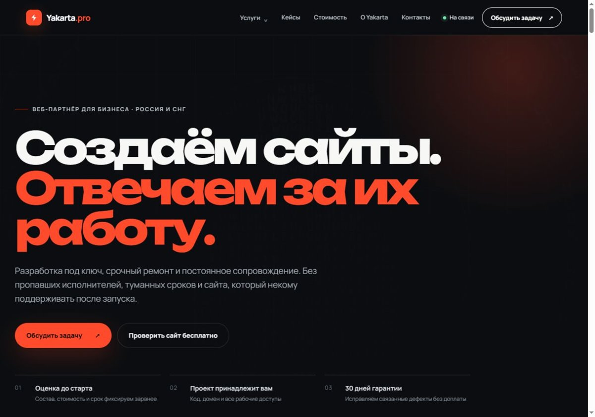
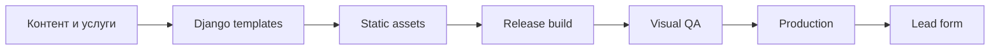

# Yakarta.pro — production web case study

Собственный коммерческий веб-проект по разработке, доработке и сопровождению сайтов. Этот репозиторий описывает мою роль, технический подход и результат без публикации production-конфигурации и рабочих данных.

[Открыть работающий сайт →](https://yakarta.pro)

## Задача

Создать понятную точку входа для клиентов, которым нужны разработка сайта, исправление проблем, ускорение и регулярная техническая поддержка. Страница должна одинаково уверенно работать на desktop и mobile и вести пользователя к заявке без лишних шагов.

## Что я сделал

- спроектировал структуру и пользовательский путь;
- разработал адаптивную дизайн-систему и ключевые страницы;
- реализовал сайт и формы на Django;
- подготовил статическую сборку и сценарии обновления;
- автоматизировал проверку скриншотов на нескольких размерах экрана;
- настроил публикацию и проверку production-версии.

## Технические решения

- Django templates и переиспользуемые UI-блоки;
- responsive CSS без зависимости от тяжёлого клиентского фреймворка;
- WebP-изображения и оптимизированная доставка статики;
- отдельные проверки ключевых экранов и контента;
- резервная копия перед обновлением production.

## Статус

Работающий production-сайт. Репозиторий содержит только case study; исходный production-код и конфигурация закрыты.

## Автор

[Эдуард Новиков](https://github.com/nenomernoi5050) — Python Backend & Automation Engineer.
